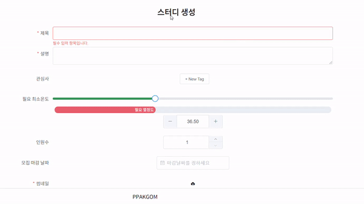
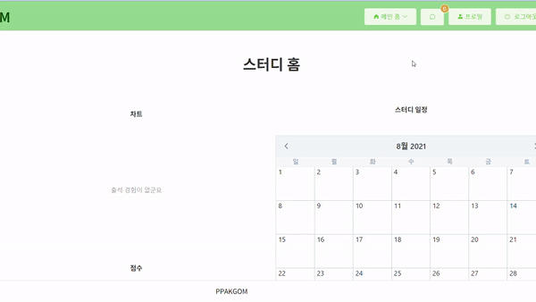
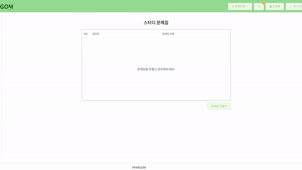
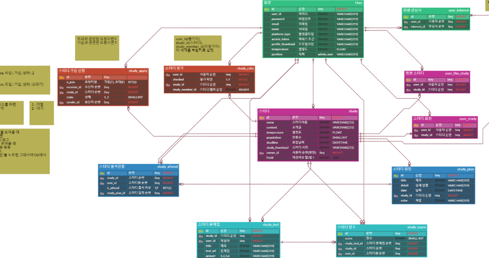

# README

# <프로젝트 소개>

## [비대면 화상 회의 & 스터디 플랫폼 "PPAKGOM"]

### :bulb: 관심사 검색을 통해 원하는 스터디를 빠르게 찾고 스터디원 평가를 통해 열정적인 스터디원과 함께 하는 화상회의 스터디 플랫폼

##### 진행 기간 : 2021.07.12 ~ 2021.08.20

##### 목표

- 코로나로 인해 오프라인 스터디가 힘든 지금, 온라인으로 스터디를 지원합니다.
- 관심분야를 통해 스터디, 스터디원을 찾을 수 있고 열정도를 보면서 좋은 팀원과 함께 할 수 있습니다.
- 공부나 관심 분야 공유를 하고 싶은 사람들 누구나 이용할 수 있고 특히, 취업 준비생의 취뽀를 응원합니다🙂

### :heavy_check_mark: 주요 기능

**스터디 검색**


**스터디 생성**



**스터디 가입**


**스터디 일정&출석**



**스터디 찜하기**


**스터디 초대**


**스터디원 평가**


**문제집 생성**



**문제풀기&결과**


<br>

### 🎈 기획

##### API 명세서

- https://confusion-hovercraft-efe.notion.site/29466b85a3c34d4cbf8a2c8a5c8bb4b9?v=14ace7cd5f1549bf924ba899610ac7ef

##### 와이어 프레임

- https://confusion-hovercraft-efe.notion.site/c905a398dbb043faab420e725292e31b

**데이터베이스**

 

<br>

### 🎨 아키텍쳐


<br>

### :gear: 개발 환경

#### Frontend

- node v14.17.2
  - https://nodejs.org/es/blog/release/v14.17.2/
- npm 6.14.13
  - https://www.npmjs.com/package/npm/v/6.14.13
- @vue/cli 4.5.13
  - https://www.npmjs.com/package/@vue/cli/v/4.5.13
- VScode Extensions
  - Vetur - Pine Wu
  - EditorConfig for VS Code
  - Vue
  - Vue VSCode Snippets - sarah.drasner

**Project setup**

```plaintext
npm install
```

**Compiles and hot-reloads for development**

```plaintext
npm run serve
```

**Compiles and minifies for production**

```plaintext
npm run build
```

#### Backend

- Java jdk 1.8

  - https://www.eclipse.org/downloads/download.php?file=/technology/epp/downloads/release/2018-09/R/eclipse-jee-2018-09-win32-x86_64.zip

- Gradle

  - https://services.gradle.org/distributions/ -> gradle-6.7-bin.zip

- MySQL 8.0.23
- full distribution on Eclipse 4.15
  - https://github.com/spring-projects/toolsuite-distribution/wiki/Spring-Tool-Suite-3
  - STS 3.9.14.RELEASE
  - 디펜던시 : Spring Boot DevTools, Lombok,MySQL Driver, QueryDSL, Stomp-WebSocket, Spring Security, JPA, Mail

<br>

#### 배포

- nginx 설치후
  /etc/sites-availble/default 변경

  -server {
  listen 80 default_server;
  listen [::]:80 default_server;
  server_name i5b306.p.ssafy.io;

            return 301 https://$server_name$request_uri;

  }

server {
listen 443 ssl;
listen [::]:443 ssl;

        root /home/ubuntu/nginx/dist;
        index index.html index.htm index.nginx-debian.html;
    
        server_name i5b306.p.ssafy.io;
    
        ssl_certificate /etc/letsencrypt/live/i5b306.p.ssafy.io/fullchain.pem;
        ssl_certificate_key /etc/letsencrypt/live/i5b306.p.ssafy.io/privkey.pem;
    
        location / {
                try_files $uri $uri/ /index.html;
        }
    
        location /api/v1 {
                proxy_pass https://i5b306.p.ssafy.io:8443;
                proxy_redirect off;
                charset utf-8;
    
                proxy_set_header X-Real-IP $remote_addr;
                proxy_set_header X-Forwarded-For $proxy_add_x_forwarded_for;
                proxy_set_header X-Forwarded-Proto $scheme;
                proxy_set_header X-NginX-Proxy true;
                add_header X-Frame-Options "SAMEORIGIN";
        }


        location /image {
                proxy_pass https://i5b306.p.ssafy.io:8443;
                proxy_redirect off;
                charset utf-8;
    
                proxy_set_header X-Real-IP $remote_addr;
                proxy_set_header X-Forwarded-For $proxy_add_x_forwarded_for;
                proxy_set_header X-Forwarded-Proto $scheme;
                proxy_set_header X-NginX-Proxy true;
        }

}

- docker-compose.yml
  - version: "3.8"
    services:
    db:
    image: mysql:5.7
    container_name: ssafy_db
    restart: always
    command: --lower_case_table_names=1
    ports: - "32000:3306"
    environment:
    MYSQL_ROOT_PASSWORD: root
    TZ: "Asia/Seoul"
    privileged: true
    volumes: - ./db:/docker-entrypoint-initdb.d
    networks: - backend
    app:
    build:
    context: ./
    container_name: ssafy_app
    restart: always
    volumes: - ./image/study:/image/study/ - ./image/user:/image/user/ - ./test:/test/
    ports: - "8080:8080" - "8443:8443"
    environment:
    TZ: "Asia/Seoul"
    SPRING_DATASOURCE_URL: "jdbc:mysql://db:3306/gom?useUnicode=true&characterEncoding=utf8&serverTimezone=Asia/Seoul&zeroDateTimeBehavior=convertToNull&rewriteBatchedStatements=true"
    server.address: 0.0.0.0
    depends_on: - db
    networks : - backend
    networks:
    backend:
- jar Dockerfile
  - From openjdk:8-jdk-alpine
    VOLUME /tmp
    ARG JAR_FILE=build/libs/\*.jar
    COPY ${JAR_FILE} app.jar
    ENTRYPOINT ["java", "-jar", "/app.jar"]
- db/init.sql
  - create database IF NOT EXISTS gom collate utf8mb4_general_ci;
    create user 'ppakgom'@'%' identified by 'ppakgom';
    grant all privileges on *.*to'ppakgom'@'%';

<br>

# 배포

## Openvidu deployment

참고 : [openvidu - deployment - On premises](https://docs.openvidu.io/en/2.19.0/deployment/ce/on-premises/)

## Openvidu 서버 배포

> openvidu on promises 방식으로 배포
>
> 이 방식은 low-level에 속하는 서버 설정(openvidu server, kurento media server, coturn, redis, nginx 등의 서버를 도커 컨테이너만 가져와서 별도로 추가 설정 없이 사용할 수 있게 하는 것)
>
> docker-compose를 이용해 위 서버들이 실행되는 도커 컨테이너들을 통합 관리
>
> 기본적으로 아래 설정들은 ubuntu 환경에서 실행됨

- 적용하면서 특이했던 사항
  기존의 kurento coturn과 충돌이 발생해 애를 많이 먹었다.

- Docker 설치

  ```bash
  $ sudo apt-get update
  $ sudo apt-get install \
      apt-transport-https \
      ca-certificates \
      curl \
      gnupg \
      lsb-release
  $ curl -fsSL https://download.docker.com/linux/ubuntu/gpg | sudo gpg --dearmor -o /usr/share/keyrings/docker-archive-keyring.gpg
  $ echo \
    "deb [arch=amd64 signed-by=/usr/share/keyrings/docker-archive-keyring.gpg] https://download.docker.com/linux/ubuntu \
    $(lsb_release -cs) stable" | sudo tee /etc/apt/sources.list.d/docker.list > /dev/null
  $ sudo apt-get update
  $ sudo apt-get install docker-ce docker-ce-cli containerd.io
  ```

- Docker-Compose 설치

  ```bash
  $ sudo curl -L "https://github.com/docker/compose/releases/download/1.29.2/docker-compose-$(uname -s)-$(uname -m)" -o /usr/local/bin/docker-compose
  $ sudo chmod +x /usr/local/bin/docker-compose
  ```

- 보안그룹 인바운드 설정

  - **22 TCP**: to connect using SSH to admin OpenVidu.
  - **80 TCP**: if you select Let's Encrypt to generate an SSL certificate this port is used by the generation process.
  - **443 TCP**: OpenVidu server and application are published by default in standard https port.
  - **3478 TCP+UDP**: used by TURN server to resolve clients IPs.
  - **40000 - 57000 TCP+UDP**: used by Kurento Media Server to establish media connections.
  - **57001 - 65535 TCP+UDP**: used by TURN server to establish relayed media connections.

- Deployment

  - root 권한 설정

    ```bash
    $ sudo su
    ```

  - /opt 폴더에 설치를 권장

    ```bash
    $ cd /opt
    ```

  - openvidu 설치

    ```bash
    $ curl https://s3-eu-west-1.amazonaws.com/aws.openvidu.io/install_openvidu_latest.sh | bash
    ```

  - configuration

    - /opt/openvidu/.env 파일 수정(letsencrypt로 수정 시)

      - DOMAIN_OR_PUBLIC_IP : 오픈바이두 서버가 사용 가능한 도메인명 또는 public ip
      - CERTIFICATE_TYPE: 증명서 타입
      - OPENVIDU_SECRET: dashboard 입장 시 로그인 패스워드(default username: OPENVIDUAPP)
      - LETSENCRYPT_EMAIL : certificate type이 letsencrypt라면 해당 증명서 발급시 입력한 이메일(아니여도 상관이 없는 것 같지만 유효한 이메일을 적어야 함)

      ```json
      DOMAIN_OR_PUBLIC_IP=i5a306.p.ssafy.io
      
      CERTIFICATE_TYPE=letsencrypt
      
      OPENVIDU_SECRET=GOM_SECRET
      
      LETSENCRYPT_EMAIL=<<유효한 이메일>>
      ```

  - start

    - /opt/openvidu/ 에서 실행

    ```bash
    $ ./openvidu start
    ```


